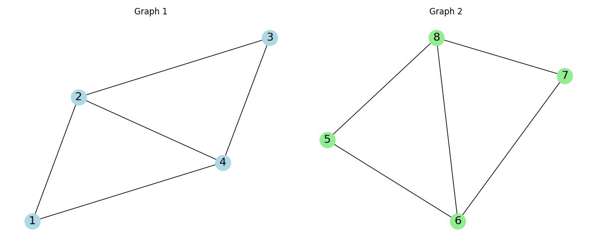

# Graph Similarity Comparison Tool



A Streamlit web application for comparing two graphs using various similarity metrics. This tool supports multiple input formats including Edge List, RDF, and Triple formats, providing visual and quantitative analysis of graph similarities through multiple comparison methods.

## Features

- Interactive web interface with:
  - Multiple input format support:
    - Edge List (simple node pairs)
    - TTL (Triple) format
    - RDF/XML format
    - N-Triples format
  - Side-by-side graph visualization with component counts
  - Tabbed results display with detailed metric explanations and formulas

- Comprehensive similarity metrics:
  1. Matrix-based Similarities:
     - Jaccard Similarity (ratio of common edges to total edges)
     - Cosine Similarity (adjacency matrix angle comparison)
     - Spectral Similarity (eigenvalue-based structural comparison)
     - Graph Edit Distance Similarity (minimum transformation cost)

  2. Structural Similarities:
     - Node and edge count matching
     - Degree sequence comparison
     - Graph density analysis
     - Connected components detection
     - Average path length comparison (for connected graphs)
     - Graph diameter analysis (for connected graphs)

  3. Node-level Properties:
     - Degree distribution patterns
     - Clustering coefficient measurement
     - Betweenness centrality analysis
     - Closeness centrality comparison

  4. Embedding-based Similarities:
     - Graph-level embedding similarity using node2vec
     - Average node embedding similarity
     - Node embedding distribution visualization

## Installation

1. Clone the repository
2. Install required dependencies:
   ```bash
   pip install -r requirements.txt
   ```

3. Run the application:
   ```bash
   streamlit run graph_similarity_app.py
   ```

## Usage

1. Select Input Format:
   Choose from four supported formats:

   a. Edge List format:
   ```
   1 2
   2 3
   3 4
   4 1
   2 4
   ```

   b. TTL (Triple) format:
   ```
   <node1> <connects> <node2> .
   <node2> <connects> <node3> .
   <node3> <connects> <node4> .
   ```

   c. RDF/XML format:
   ```xml
   <?xml version="1.0"?>
   <rdf:RDF xmlns:rdf="http://www.w3.org/1999/02/22-rdf-syntax-ns#"
            xmlns:ex="http://example.org/">
     <rdf:Description rdf:about="http://example.org/node1">
       <ex:connects rdf:resource="http://example.org/node2"/>
     </rdf:Description>
   </rdf:RDF>
   ```

   d. N-Triples format:
   ```
   <http://example.org/node1> <http://example.org/connects> <http://example.org/node2> .
   <http://example.org/node2> <http://example.org/connects> <http://example.org/node3> .
   ```

2. Input Graph Data:
   - Enter graph data in the selected format for both graphs
   - For RDF formats, the tool will automatically extract numeric node IDs or generate them from URIs

3. View Results:
   - Graph visualizations with component counts
   - Detailed similarity metrics across four categories
   - Interactive formulas and calculation steps
   - Distribution visualizations for node embeddings

4. Interpret Results:
   - ✅ indicates exact matches between graphs
   - ❌ indicates differences between graphs
   - Similarity values range from 0.0 (different) to 1.0 (identical)
   - For differences, values closer to 0.0 indicate more similarity

## Notes

- Supports multiple input formats for flexibility
- Automatically converts RDF node identifiers to numeric IDs
- Handles both simple edge lists and semantic graph formats
- Some metrics only available for connected graphs
- Embedding calculations require connected graphs with sufficient nodes
- Default examples provided for each input format

## Implementation Details

- Uses NetworkX for graph operations and metrics
- Implements RDFLib for parsing RDF formats
- Calculates matrix similarities using numpy/scipy
- Handles disconnected graphs by computing metrics per component
- Provides detailed calculation steps and formulas
- Optimized visualization using matplotlib

## Live Demo

Try the app at: [](https://oldcats-graph-similarity-comparison-graph-similarity-app-dfeblx.streamlit.app/)
